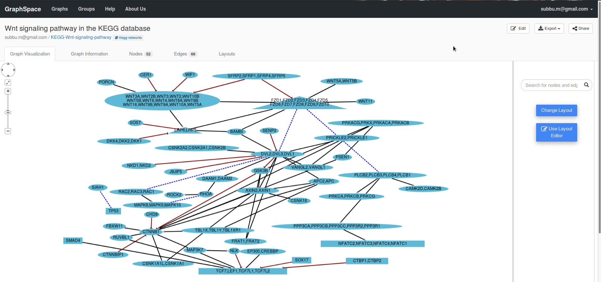
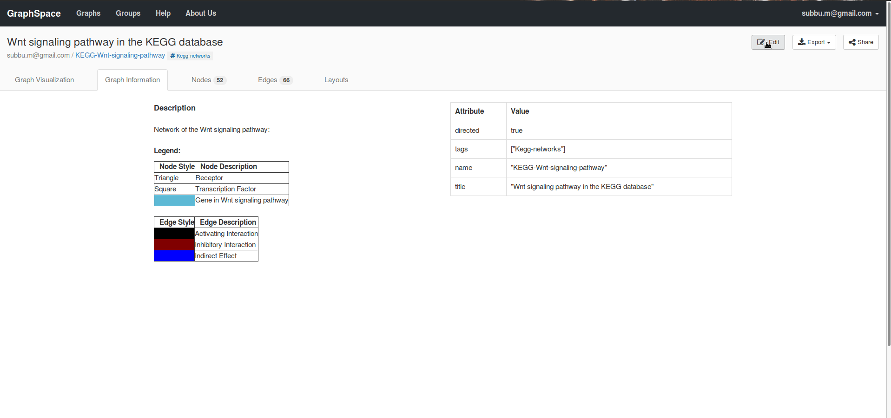

# Editing Graph Data Attributes

GraphSpace includes a user interface to modify the [Graph Data Attributes](https://github.com/Murali-group/GraphSpace/blob/master/docs/GraphSpace_Network_Model.md#graph-data-attributes).
Through this interface a [GraphSpace](http://www.graphspace.org) user will be able to:

- [Modify graph title](#edit-graph-title)
- [Modify graph name](#edit-graph-name)
- [Modify graph information/legend](#edit-graph-description)
- [Add/remove tags](#edit-graph-tags)

The user can activate this functionality by clicking the `Edit` button on the page for an individual network.

## Edit graph title

A [Graphspace](http://www.graphspace.org) user can edit the graph title by following the given steps:

1. Click on the `Edit` button present on the right top corner of the page given for an individual network.
2. Enter the **new title** in the space provided under the `Title` heading.
3. Click on `Save` if you want to save the changes else click on the `Cancel` button to discard the changes.
4. On clicking the `Save` button you will be notified with a success or error message based on whether **title** of the graph has been updated or not.

## Edit graph name

A [Graphspace](http://www.graphspace.org) user can edit the graph name by following the given steps:

1. Click on the `Edit` button present on the right top corner of the page given for an individual network.
2. Enter the **new name** in the space provided under the `Name` heading.
3. Click on `Save` if you want to save the changes else click on the `Cancel` button to discard the changes.
4. On clicking the `Save` button you will be notified with a success or error message based on whether **name** of the graph has been updated or not.

## Edit graph description

A [Graphspace](http://www.graphspace.org) user can edit the graph description/legend by following the given steps:

1. Click on the `Edit` button present on the right top corner of the page given for an individual network.
2. Navigate to the `Graph Information` Page.
3. Enter the **new description** in the space provided under the `Description` heading.
3. Click on `Save` if you want to save the changes else click on the `Cancel` button to discard the changes.
4. On clicking the `Save` button you will be notified with a success or error message based on whether **description** of the graph has been updated or not.

## Edit graph tags

A [Graphspace](http://www.graphspace.org) user can add/remove tags by following the given steps:

1. Click on the `Edit` button present on the right top corner of the page given for an individual network.
2. Enter the **new tags** in the space provided under the `Add/Remove tags` heading with space separation.
3. You can remove the **old tags** by clicking on the `x` symbol provided for each tag.
4. Click on `Save` if you want to save the changes else click on the `Cancel` button to discard the changes.
5. On clicking the `Save` button you will be notified with a success or error message based on whether **tags** of the graph have been updated or not.

