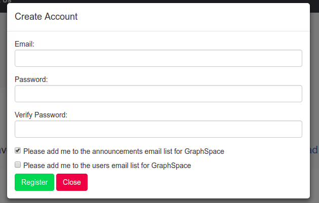

# Email Lists for GraphSpace

[GraphSpace](http://graphspace.org) built announcements and users email lists to post important announcements and allow users to communicate with each other. 

## Users Email List for GraphSpace
The users list is meant for all users of GraphSpace to communicate with each other and with the GraphSpace administrators. Please use this list to pose questions about GraphSpace, discuss any problems you may have, give us feedback, request features etc.

### Subscribe 
To subscribe you can choose "Please add me to the users email list for GraphSpace" when create account, 

or send an email with 'subscribe' in the subject to [graphspace-users-join@graphspace.org](mailto:graphspace-users-join@graphspace.org).

### Unsubscribe
To unsubscribe from users list, send an email with 'unsubscribe' in the subject to [graphspace-users-leave@graphspace.org](mailto:graphspace-users-leave@graphspace.org).

### Post 
To post to users list, send your email to [graphspace-users@graphspace.org](mailto:graphspace-users@graphspace.org).

### Archives
You can access the [archives](http://email.graphspace.org/hyperkitty/list/graphspace-users@graphspace.org/) of the users list. 

## Announcements Email List for GraphSpace
The GraphSpace administrators will use this list to post important announcements about GraphSpace. Note that you will not be able to post to this mailing list.  If you have a question about GraphSpace, please join the graphspace-users mailing list and post there.

### Subscribe 
To subscribe you can choose "Please add me to the announcements email list for GraphSpace" when create account, 

or send an email with 'subscribe' in the subject to [graphspace-announcements-join@graphspace.org](mailto:graphspace-announcements-join@graphspace.org).

### Unsubscribe
To unsubscribe from announcements list, send an email with 'unsubscribe' in the subject to [graphspace-announcements-leave@graphspace.org](mailto:graphspace-announcements-leave@graphspace.org).

### Archives
You can access the [archives](http://email.graphspace.org/hyperkitty/list/graphspace-announcements@graphspace.org/) of the announcements list. 
