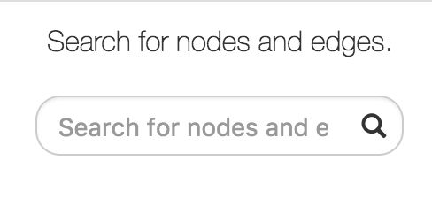
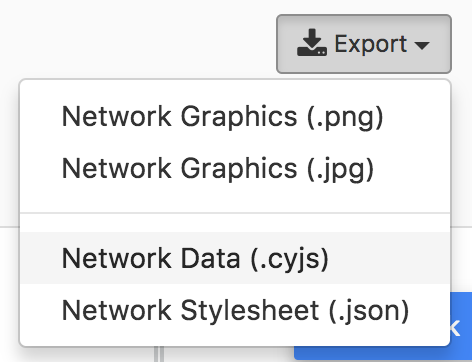

# Interacting with Graphs

In this section, we examine different ways to interact with an individual network on its page. The information that appears in following examples must be included in the JSON files that are uploaded by the network owner, as described in the [Network Model](/GraphSpace_Network_Model.html) section. An individual network page is designed to access features like:

- [Searching within a graph](#search)
- [Exporting a graph](#export)
- [Changing the graph layout](#change-layout)
- [Setting default layout](#default-layout)
- [Filtering nodes and edges](#filter-nodes-and-edges)

## Search 

This feature provides a search bar that allows the user to find nodes/edges that match the search terms. See [Search Query Semantics](Searching_Graphs.html#query-semantics) section for more information on query semantics. The matching nodes or edges are [highlighted](Viewing_Graphs.html#highlighted-graph-elements) automatically as you type in the query in the search bar.

## Export 

[GraphSpace](http://www.graphspace.org) allows users to export a graph in the following formats:

1. **Network Graphics (.png)** - Export the current graph view as a PNG image.
2. **Network Graphics (.jpg)** - Export the current graph view as a JPEG image.
3. **Network Data (.png)** - Export the graph in [CYJS format](Uploading_Graphs.html#cyjs-format).
4. **Network Graphics (.png)** - Export the graph stylesheet in [Stylesheet JSON format](Uploading_Graphs.html#stylesheet-json).

GraphSpace does not support any other export formats since it relies on [Cytoscape.js](http://js.cytoscape.org) for this functionality, which implements only export to PNG, JPG and JSON format. 

## Change Layout

Layouts provide a powerful means to organize nodes within a network. [GraphSpace](http://www.graphspace.org) allows users to change layout using the following steps:

1. Click on the `Change Layout` button to view available layout options.
2. The `Change Layout` panel provides two alternatives:
    - **Select Layout Algorithm** - This section lists all the automatic network layout
algorithms supported by GraphSpace through its use of [Cytoscape.js](http://js.cytoscape.org).
    - **Select Saved Layout** - This section lists layouts saved by the user. The user has created them in earlier sessions by using the layout editor or manually modifying the positions of nodes and edges created by some automatic layout algorithm and saving the layout.
3. Click on a layout option to change the current layout.
 
 In the following example, the user selects to view the layout titled ``manual-top-to-bottom``. To create this layout, the user manually moved nodes so that extracellular ligands and receptors (triangles) appear on the top while transcription factors (rectangles) appear at the bottom. The user can click on the ``Back`` button to return to the main menu.
    

<!-- -->

## Set Default Layout

**Default layout** is the layout which is used by default, whenever a user visits the page for a graph. A layout can be set as a default layout for a graph only if it is shared with other users who have access to the graph. Default layout for a graph can only be set by the owner of the graph.

If a layout is shared with other users who have access to the graph, user can click on the `Set as Default Layout` button to set the layout as the default layout for the graph.

If a layout is set as default layout, user can click on the `Remove as Default Layout` button to unset the layout as the default layout for the graph.

## Filter nodes and edges

Graph algorithms may output networks where nodes and edges can be ranked, e.g., by path index or by weight/score. GraphSpace allows each node and edge to have an integer-valued data-attribute called `k` that specifies the rank of the node or the edge. For any network that contains this attribute (and only for such networks), GraphSpace displays the "Filter nodes and edges" panel with a `Current rank` slider. Changing the value in the `Current rank` slider hides all nodes and edges whose k values are less than or equal to the value in the slider. The possible values in this slider range from 1 to the maximum value of `k` in the graph. This interface element allows the user to unveil the network gradually in real time and gain intuition about how the network expands or contracts as this threshold changes.

The following example shows a user stepping through a graph using this slider. 
    

