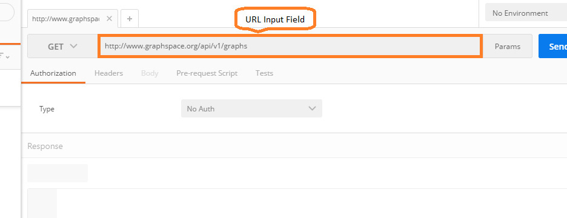
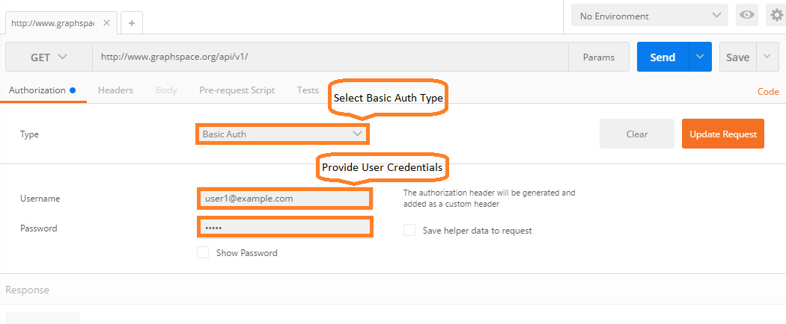
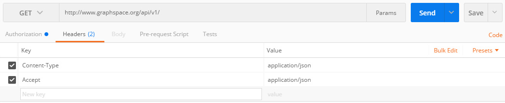
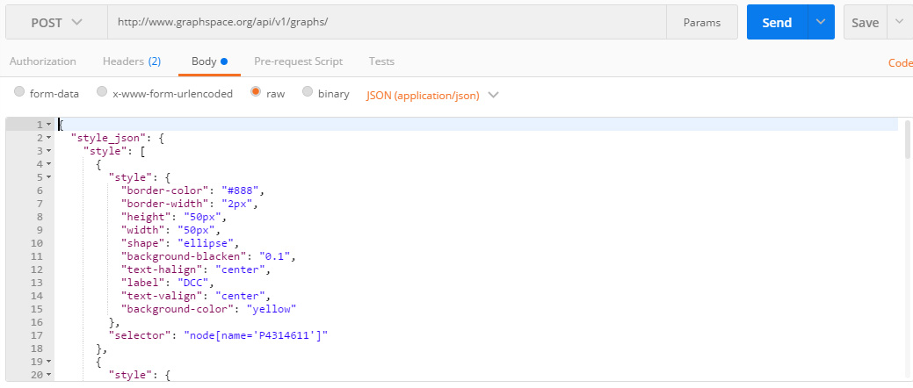
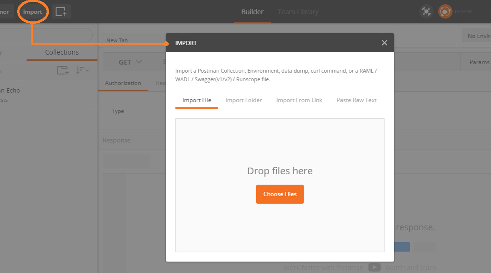

# Programmers Guide

## What is GraphSpace REST API ?

The GraphSpace REST API provides endpoints for entities such as graphs, layouts, and groups that allow developers to interact with the GraphSpace website remotely by sending and receiving JSON objects. This API enables developers to create, read, and update GraphSpace content from client-side JavaScript or from applications written in any language. After a network is uploaded, the API allows the network owner to modify, delete, and share it. The API also allows a user to access several group management features available through the web interface. For example, a user can create or remove a group, add or remove members, obtain a list of groups he or she belongs to, and get information such as the membership on a group.

```
Note: In order to fully utilize the features of GraphSpace REST API, you must have an account on GraphSpace.
```

### Why use GraphSpace REST API ?

The GraphSpace REST API makes it easier than ever to use GraphSpace in new and exciting ways, such as creating external applications on top of GraphSpace. For example, 

- Create a Cytoscape plugin which will allow users to transfer networks between GraphSpace and Cytoscape. 
- Users can also automate the way they upload graphs to GraphSpace.

The scope of what can be done with the GraphSpace REST API is only limited by our imagination. Overall, if a user want a structured, extensible, and simple way to get data in and out of GraphSpace over HTTP, they should probably use the GraphSpace REST API.

### Base URL

All URLs referenced in the documentation have the following base:

> http://www.graphspace.org/api/v1/

<!---
The GraphSpace REST API is served over HTTP. In case you are 
-->


### API Reference

<iframe src="http://35.163.136.54/static/api.html" style="height: 100vh;width: 100%;"></iframe>

## HTTP Status Codes
The [GraphSpace](https://graphspace.org) API attempts to return appropriate HTTP status codes for every request.</p>

### Success Codes
* ***200:*** Your request has succeeded.

* ***201:*** Your request has been fulfilled and resulted in a new resource being created.

### Error Codes
* ***400:*** Bad Request! The server cannot or will not process your request due to an apparent client error (e.g., malformed request syntax, too large size, invalid request message framing, or deceptive request routing).

* ***401:*** Unauthenticated! Either your authentication token is missing or invalid, or you are not allowed to access the content provided by the requested URL.

* ***403:*** Unauthorized! You are not authorized to access this resource, create an account and contact resource's owner for permission to access this resource.

* ***405:*** Method Not Allowed! Your request method is not supported by the resource. For example, using GET on a form which requires data to be presented via POST, or using PUT on a read-only resource.

* ***1000:*** User with the provided email id already exists!

* ***1003:*** Your Username or Password is not recognized.

* ***1006:*** `is_public` is required to be set to True when `owner_email` and `member_email` are not provided.

* ***1007:*** You are not authorized to access private graphs created by other users.

* ***1008:*** You are not allowed to create a graph for other users.

* ***1009:*** Your graph ID is missing.

* ***1010:*** You are not authorized to access groups you aren't part of. Set `owner_email` or `member_email` to your email.

* ***1011:*** You are not allowed to create a group for other users.

* ***1012:*** You are not authorized to access layouts which are not shared. Set `owner_email` to your email or `is_shared` to 1.

* ***1013:*** Cannot create the layout with your provided owner email.

* ***1014:*** Layout with the provided name already exists.

## graphspace-python

The GraphSpace software also includes a simple yet powerful Python library called ``graphspace python`` that allows a user to rapidly construct a network, add nodes and edges, modify their visual styles, and then upload the network, all within tens of lines of code. Moreover, the user need not know the details of the REST API to use this module. It is very easy to integrate this library into a user's software pipeline.

### Installation

Install graphspace_python from PyPI using:

```
    pip install graphspace_python
```

### Usage

Please refer to ``graphspace_python`` package's [documentation](http://manual.graphspace.org/projects/graphspace-python/) to learn how to use it. 


## GraphSpace REST APIs using the Postman app

### This documentation is based on [Sandeep Mahapatra's blog post](https://summerofcode17.wordpress.com/2017/05/30/using-the-graphspace-restful-api/) in the 2017 GSoc.


```
    Note: In order to fully utilize the features of GraphSpace REST API, you must have an account on GraphSpace.
```

Postman is a Google Chrome app for interacting with HTTP APIs. It provides a friendly GUI for constructing requests and reading responses. Postman makes it easy to test, develop and document APIs by allowing users to quickly put together both simple and complex HTTP requests.

### Postman Installation

Postman is available as a [native app](https://www.getpostman.com/docs/install_native) (recommended) for Mac / Windows / Linux, and as a Chrome App. The Postman Chrome app can only run on the Chrome browser. To use the Postman Chrome app, you need to:
- Install Google Chrome: [Install Chrome](https://www.google.com/chrome/).
- If you already have Chrome installed, head over to Postman’s page on the [Chrome Webstore](https://chrome.google.com/webstore/detail/postman-rest-client-packa/fhbjgbiflinjbdggehcddcbncdddomop?hl=en), and click ‘Add to Chrome’.
- After the download is complete, launch the app.

### Using Postman for GraphSpace REST API

The GraphSpace REST APIs have the base URL http://www.graphspace.org/api/v1/. There are many endpoints defined under this base URL (the documentation of which can be found here), but to learn and understand the usage of GraphSpace REST APIs through Postman, we would be considering only the /graphs endpoint for GET and POST request.
- The GET /graphs request fetches a list of graphs from GraphSpace matching the query parameters.
- The POST /graphs request creates a graph in GraphSpace.

### GET /graphs
- The URL is the first thing that we would be setting for a request. We will set the URL to http://www.graphspace.org/api/v1/graphs.

- Provide Authorization: Select ‘Basic Auth’ from Authorization type drop-down. Enter the username and password and click on ‘Update Request’.

- Set Header: Add the following key value pairs, ```Content-Type:application/json and Accept:application/json.```

- Select Method: Changing the method is straightforward. Just select the method from the select control. We will use GET method here.
- Add URL Params:  Clicking on the URL Params button will open up the key-value editor for entering URL parameters. The details of the URL Params for /graphs endpoint can be found in the [documentation](http://manual.graphspace.org/en/latest/Programmers_Guide.html#api-reference).
- Click on the Send button to the send the request. A list of graphs matching the query parameters will be received in the response.

### POST /graphs
- The initial steps of setting URL, Authorization and Header are performed.
- Change Method to POST.
- Set Request Body: Click on Body to open the request body editor. Select raw request from the choices and JSON(application/json) from the drop-down. Enter the json data for the graph to be created in the editor. The details regarding the properties of the json graph body can be found in the [documentation](http://manual.graphspace.org/en/latest/Programmers_Guide.html#api-reference).

- Click on the Send button to the send the request. A new graph object will be created and returned in the response.

### Postman Collection

A collection lets you group individual requests together. These requests can be further organized into folders to accurately mirror our API. Requests can also store sample responses when saved in a collection. You can add metadata like name and description too so that all the information that a developer needs to use your API is available easily. Collections can be exported as JSON files. Exporting a collection also saves the Authorization details. Hence, it is advised to remove the Authorization details from the Header before exporting.

For quick use of the GraphSpace REST APIs or if you are stuck somewhere and you want reference, you can [download the collection of the APIs here](https://gist.github.com/sandeepm96/a824a6d0e643811389a6bf212e30a381). The collection has details regarding the API endpoints like params and body properties. Importing steps:
- Click Import button in the top menu.
- Choose the Import File in the pop up window.

- Provide the Authorization details for the imported requests (as Authorization details have been removed for security concern)

