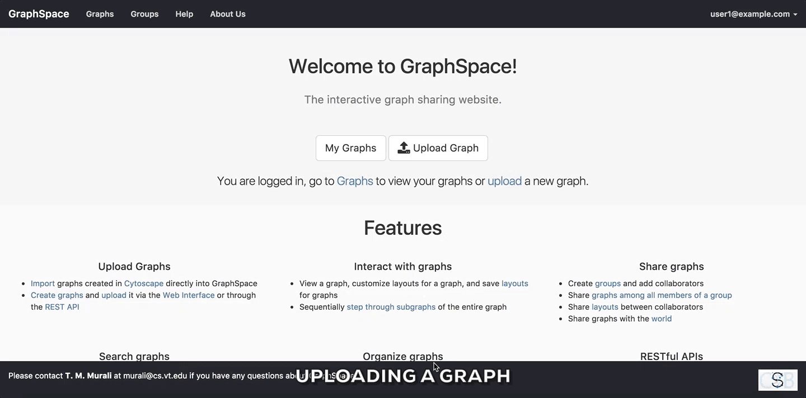
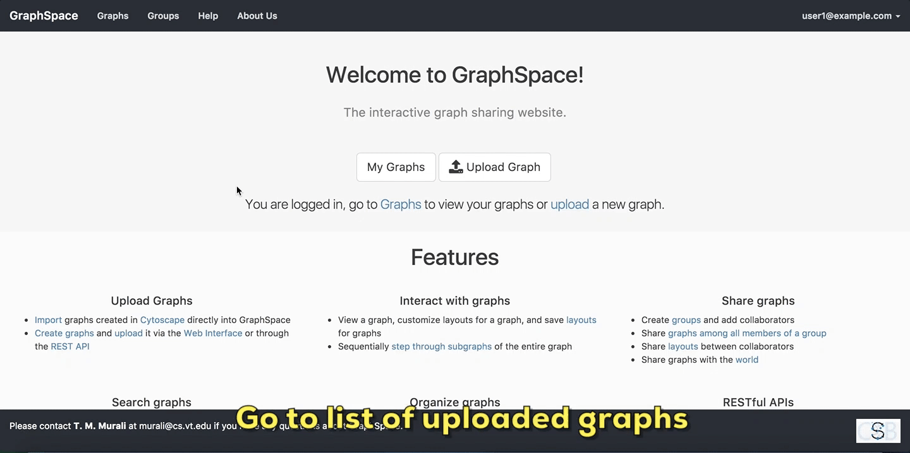
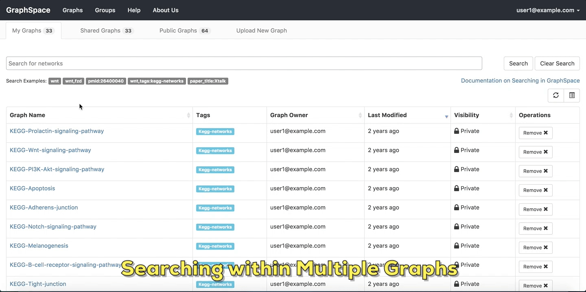
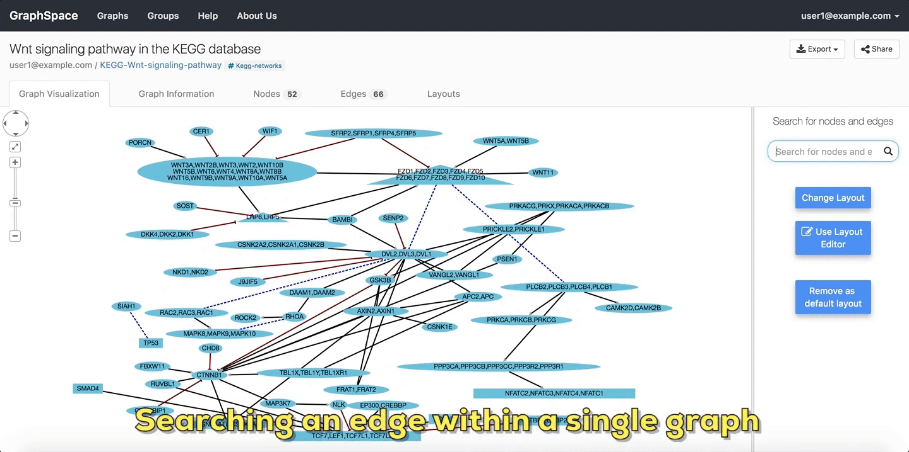
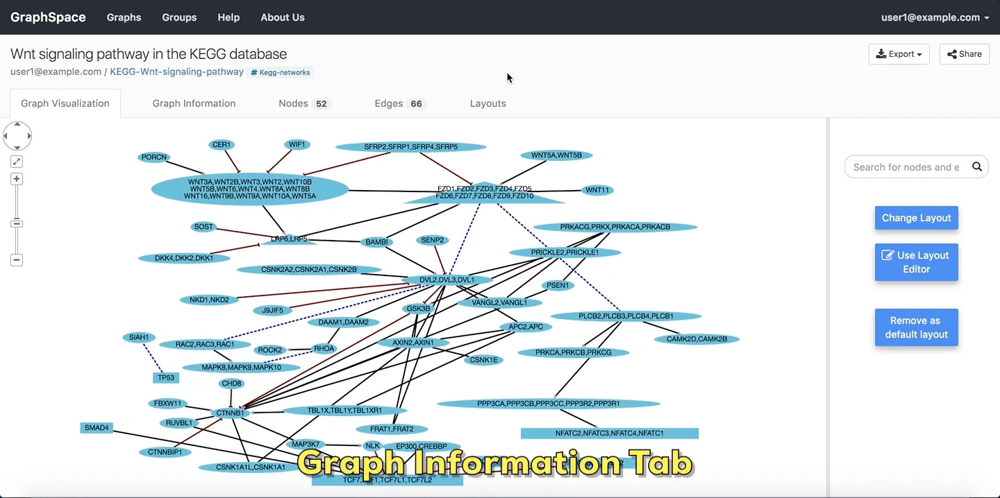

# Quick Tour of GraphSpace

## Welcome Screen

The [welcome page](http://graphspace.org) greets a user when the user visits [GraphSpace](http://graphspace.org). The Welcome Screen is designed to access commonly used features of [GraphSpace](http://graphspace.org) like:

- [Create Account](#create-account)
- [Log In](#log-in)
- [Upload a graph](#upload-a-graph)
- [List of uploaded graphs](#list-of-uploaded-graphs)

### Create Account

The user can create an account on [GraphSpace](http://www.graphspace.org) by following the given steps:

1. Click on the `Create Account` button on the top navigation bar. This will trigger a create account window/pop-up to be displayed.
2. Enter the your email address. 
3. Enter a password for your account.
4. Verify your password by entering the same password again.
5. Click on `Submit` button to create the account with the given email address and password.

### Log In

The user can log-in to [GraphSpace](http://www.graphspace.org) by following the given steps:

1. Click on the `Log In` button on the top navigation bar. This will trigger a log-in window/pop-up to be displayed.
2. Enter your email address. 
3. Enter you password.
4. Click on `Submit` button to log in with the given email address.
5. If you have forgotten you password, click on the `Forgot Password` link.

For the rest of the tutorial, we assume that the user has already created an account. We also assume that the user belongs to a group with shared networks or that the user uploaded networks via the [upload page](Uploading_Graphs.html#upload-page) or the [RESTful API](Programmers_Guide.html#api-reference). The tutorial specifically steps through how ``user1@example.com`` interacts with GraphSpace after logging in.

### Upload a graph

The user can upload a graph on [GraphSpace](http://www.graphspace.org) by following the given steps:

1. Go to the [Upload Graph Page](http://www.graphspace.org/upload) by clicking on the `Upload Graph` button on [Home Page](http://www.graphspace.org/).
2. Enter a [unique name](Uploading_Graphs.html#graph-name) for the new graph.
3. Select a [CYJS file](GraphSpace_Network_Model.html#cyjs-format) which contains the graph information.
4. Select a [JSON file](GraphSpace_Network_Model.html#stylesheet-json-format) which contains the style information for the graph. (Optional Step)
5. Click on `Submit` button to upload the graph using the selected files.
6. Once the graph has been uploaded, [GraphSpace](http://www.graphspace.org) will provide a unique URL through which the user may interact with the graph represented by the uploaded files.

You can use the following sample files to learn how to upload graphs to GraphSpace:
- [Sample network file](_static/sample_graph.cyjs)
- [Sample style file](_static/sample_stylesheet.json)

### List of uploaded graphs

The user can go to [a page that lists the graphs](http://www.graphspace.org/graphs/) accessible by the user on [GraphSpace](http://www.graphspace.org) by following the given steps:

- Click on the button titled `Graphs` on the top navigation bar.
     OR
- Click on the `My Graphs` button on the [Home Page](http://www.graphspace.org/).

In this example, the user owns 33 graphs, can access 64 public graphs and 33 graphs are shared with this user.

## Searching within Multiple Graphs

The search interface in GraphSpace allows a user to search for networks that have a specific attribute or tag and contain one or more nodes using [simple syntax](Searching_Graphs.html#query-semantics) on [Graphs Page](http://www.graphspace.org/graphs/) by following the given steps:

1. Enter the name of the graph/node or specific network attribute mapping you are searching for in the search bar.
2. Press `Enter` key or click on the `Search` button.

In this example, the user searches for the list for graphs that contain the protein (node) `CTNNB1` (the symbol for β-catenin, a transcriptional regulator in the Wnt signaling pathway). The reduced list of graphs are the graphs where protein (node) ``name``, ``label`` or ``aliases`` contain `CTNNB1` as a substring. The match is case-insenstive. In the following example, There are six graphs owned by the user and thirty-two public graphs that contain this protein. Each link in the `Graph Name` column will take the user to a specific graph with the search term [highlighted](Viewing_Graphs.html#highlighted-graph-elements). In this example, the user clicks on the graph with the name `KEGG-Wnt-signaling-pathway` and reaches the graph for the Wnt pathway with the searched node [highlighted](Viewing_Graphs.html#highlighted-graph-elements).

## Searching within a Single Graph

The user can search for node or edges within a given graph on [GraphSpace](http://www.graphspace.org/) by following the given steps:

1. Enter the name of the node or an edge you are searching for in the [search bar](Interacting_with_Graphs.html#search).
2. The nodes or edges are [highlighted](Viewing_Graphs.html#highlighted-graph-elements) automatically as you type in the name of the node or edge in the search bar.

In the following example, the user searches for the graph for two proteins (nodes) `CTNNB1` and `WNT` using the query `ctnnb1, wnt`. This search query [highlights](Viewing_Graphs.html#highlighted-graph-elements) the proteins where protein (node) ``name``, ``label`` or ``aliases`` contains `CTNNB1` or `WNT` as a substring (case-insensitive). In the following example, the graph contains four nodes which match the given query.

In the following example, the user [searches the graph for edges](Searching_Graphs.html#query-semantics) from `Wnt` to `Fzd` using the query `Wnt::Fzd`. GraphSpace
[highlights](Viewing_Graphs.html#highlighted-graph-elements) any edge whose tail node matches ``wnt`` and whose head node matches ``fzd``. In the following example, the graph contains three edges which match the given query.

## Interacting with a Graph

In this section, we examine [different ways to interact with an individual network](Interacting_with_Graphs.html) on its page. The information that appears in following examples must be included in the JSON files that are uploaded by the network owner, as described in the [Network Model](GraphSpace_Network_Model.html) section. An individual network page is designed to access features like:

- [Graph Information](#graph-information)
- [Edge and Node Information](#edge-and-node-information)
- [Export Graph](#export-graph)
- [Change Layout](#change-layout)
- [Share Layout](#share-layout)

### Graph Information

As its name suggests, the `Graph Information` panel displays information about the entire graph, e.g., a legend of node and edge shapes and colors. The ``description`` attribute in the [JSON for the network](GraphSpace_Network_Model.html#graph-data-attributes) specifies this content. The user can go to `Graph Information` panel by clicking on the `Graph Information` link above the graph.

Please refer to [this section](Viewing_Graphs.html#graph-information-tab) for more information.

### Edge and Node Information

Clicking on a node or edge pops up a panel with information on that node or edge. The ``popup`` attribute for the node in the [network JSON](GraphSpace_Network_Model.html#cyjs-format) specifies this content.

Please refer to [this section](Viewing_Graphs.html#node-and-edge-popups) for more information.

### Export Graph

[GraphSpace](http://www.graphspace.org) allows users to export a graph as an image file or a JSON file. GraphSpace does not support any other export formats since it relies on [Cytoscape.js](http://js.cytoscape.org) for this functionality, which implements only export to PNG, JPG and JSON format. 

In the following example, the user is exporting the graph as an image in PNG format.

Please refer to [this section](Interacting_with_Graphs.html#export) for more information.

### Change Layout

Layouts provide a powerful means to organize nodes within a network. The following figures illustrate how a user may access and view automatically generated and previously saved layouts.

[GraphSpace](http://www.graphspace.org) allows users to change layout using the following steps:

1. Click on the `Change Layout` button to view available layout options.
2. The `Change Layout` panel provides two alternatives:
    - **Select Layout Algorithm** - List of layout algorithms supported by GraphSpace through its use of [Cytoscape.js](http://js.cytoscape.org).
    - **Select Saved Layout** - List of layout saved by the user using GraphSpace. The user has created them in earlier sessions by manually modifying the positions of nodes and edges created by some automatic layout algorithm and saving the layout.
3. Click on a layout option to change the current layout.

In the following example, the user selects to view the layout titled "manual-top-to-bottom". To create this layout, the user manually moved nodes so that extracellular ligands and receptors (triangles) appear on the top while transcription factors (rectangles) appear at the bottom. The user can click on the ``Back`` button to return to the main menu.
    

Please refer to [this section](Interacting_with_Graphs.html#change-layout) for more information.

### Share Layout

[GraphSpace](http://www.graphspace.org) allows users to share a layout using the following steps:

1. Click on the `Layouts` link above the graph.
2. The layouts panel shows two types of layouts:
    - **Private Layouts** - The user has created them in earlier sessions by manually modifying the positions of nodes and edges. But the user has not shared them with any other user.
    - **Shared Layouts** - These layouts were created by the user who has access to this graph and shared the layout with other users who have access to this graph.
    
3. Click on the `Share` link next to the layout name of a private layout you want to share with other users who have access to this graph.

Note: The icons next to each layout name allow the user to (i) change its name, (ii) share it with other users who have access to this graph, (iii) delete this layout.

Please refer to [this section](Sharing_Graphs.html#sharing-layouts-with-group-s) for more information.

