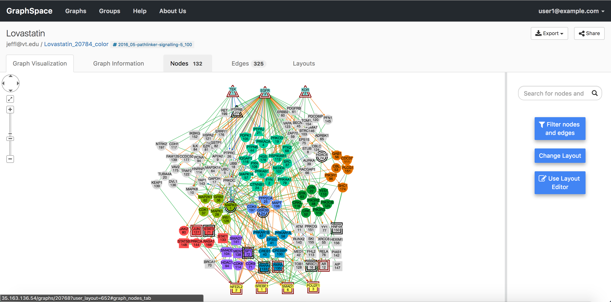
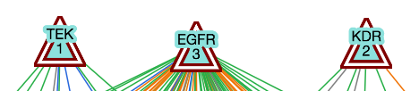
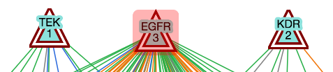
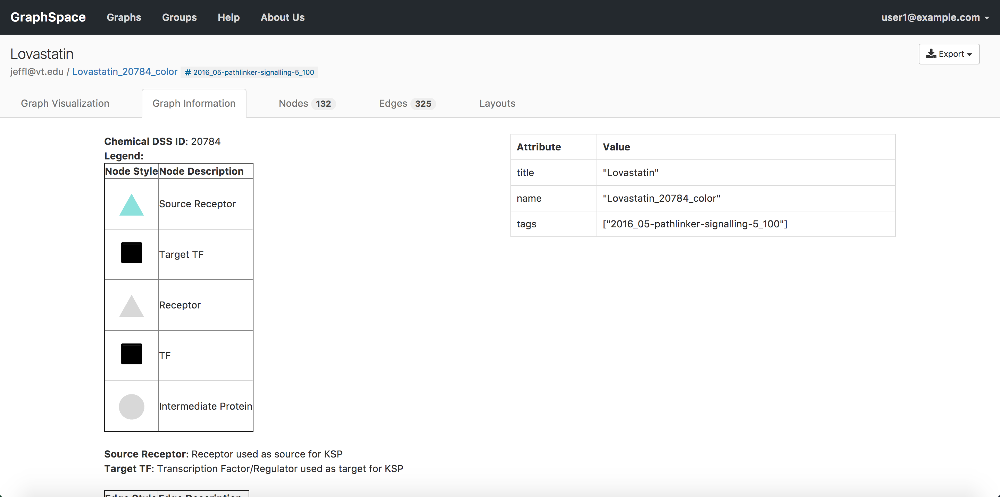

# Viewing Graphs

When viewing a graph, you will notice several tabs above the graph. Clicking on a tab link will reveal the tab. The Graph Page has following 5 tabs:

- [Graph Visualization Tab](#graph-visualization-tab)
- [Graph Information Tab](#graph-information-tab)
- [Edges Tab](#edges-tab)
- [Nodes Tab](#nodes-tab)
- [Layouts Tab](#layouts-tab)

## Graph Visualization Tab

The Graph Visualization Tab has two sections:
- Left section shows the actual graph.
- Right section shows multiple [interaction](/Interacting_with_Graphs.html) options.

In this example, the graph has 325 edges and 132 nodes.

### Node and Edge Popups

Each node or edge in a graph may have information embedded in it via the [popup attribute](/GraphSpace_Network_Model.html#node-data-attributes-attributes-treated-specially-by-graphspace). Clicking on a node or edge will [highlight](#highlighted-graph-elements) them. If the clicked node/edge contains popup attribute, popup attribute's value will appear in a pop-up box; otherwise, no popup will be shown. If the popup attribute's value is formatted in HTML, GraphSpace will interpret it appropriately else it will use it as free-text information. 

The image below shows an example of the popup shown for a node JAK2. 

### Highlighted Graph Elements

GraphSpace highlights nodes/edges if they are selected. If selected, [GraphSpace](http://graphspace.org) highlights the elements by adding an overlay around the elements in red color.
 

<table cellspacing="0">
<caption>The image below shows an example of node EGFR before and after highlighting.</caption>
<tr> 
   
   <td class="">
      
   </td>               
   <td class="">
      
   </td> 
</tr>
<tr>                          
   <th>EGFR before highlighting </th> 
   <th>EGFR after highlighting </th>              
</tr>
</table>

## Graph Information Tab

As its name suggests, the `Graph Information` tab displays information about the entire graph, e.g., a legend of node and edge shapes and colors. The ``description`` attribute in the [JSON for the network](/GraphSpace_Network_Model.html#graph-data-attributes) specifies this content. The ``Graph Information`` tab for an individual network also displays all [its attributes and their values](/GraphSpace_Network_Model.html#graph-data-attributes). The user can go to `Graph Information` tab by clicking on the `Graph Information` tab link above the graph. 

The image below shows an example of Graph Information Tab when user clicks on the `Graph Information` tab link:

## Edges Tab

As its name suggests, the `Edges` tab displays information about the edges in a table format. The table contains following columns:

1. **Edge Name** - Name of the edge.
2. **Tail Node** - Label of the tail node.
3. **Head Node** - Label of the head node.

The image below shows an example of Edges Tab when a user clicks on the `Edges` tab link:

## Nodes Tab

As its name suggests, the `Nodes` tab displays information about the nodes in a table format. The table contains following columns:

1. **Node Name** - Name of the node.
2. **Node Label** - Label for the node.

The image below shows an example of Nodes Tab when user clicks on the `Nodes` tab link:

## Layouts Tab

As its name suggests, the `Layouts` tab displays information about the layouts in a table format. The tab contains two types of layouts:

- **Private Layouts** - The user has created them in earlier sessions by manually modifying the positions of nodes and edges. But the user has not shared them with any other user.
- **Shared Layouts** - These layouts were created by the user who has access to this graph and shared the layout with other users who have access to this graph.
    
The icons next to each layout name allow the user to (i) change its name, (ii) share/unshare it with other users who have access to this graph, (iii) delete this layout.

The image below shows an example of Layouts Tab when user clicks on the `Layouts` tab link. In this example, the user has created 1 private layout and has access to four shared layouts.

